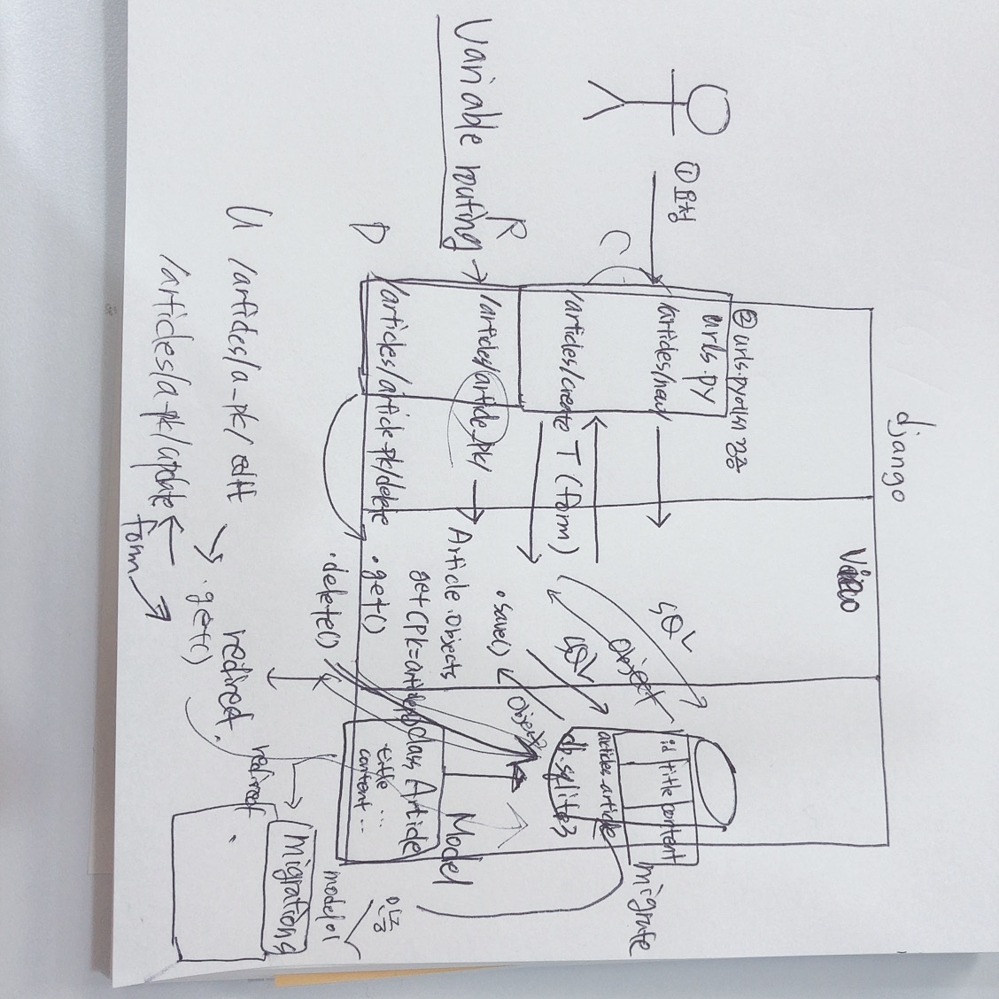
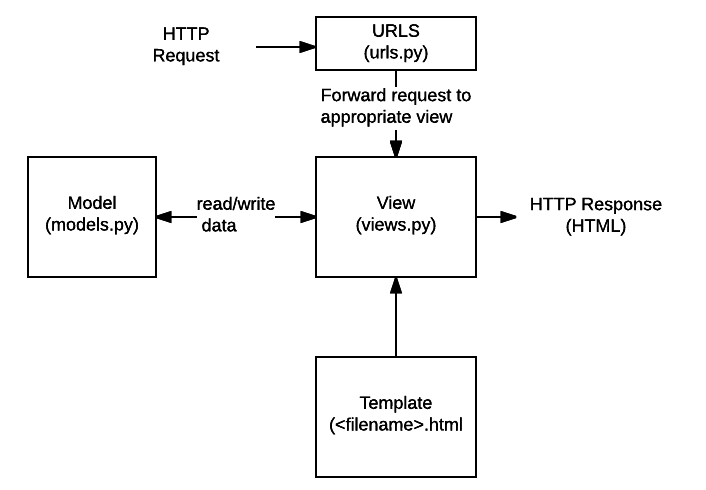

# Crud Django Project

* 가상환경 생성/실행

  ```bash
  $ python -m venv venv
  (3.7.4)
  
  $ activate
  (venv)
  ```

* `.gitignore`

  * `venv/`
  * `.vscode/`
  * `__pycache__/`

* git init

* django 설치

  * 설치하지 않으면 아래와 같은 에러가 뜸

  ```bash
  ImportError: Couldn't import Django. Are you sure it's installed and available on your
  PYTHONPATH environment variable? Did you forget to activate a virtual environment?
  (venv)
  ```

  

  ```bash
  $ pip list
  Package    Version
  ---------- -------
  pip        19.0.3
  setuptools 40.8.0
  
  $ pip install django django_extensions
  
  $ pip list
  Package           Version
  ----------------- -------
  Django            2.2.4
  django-extensions 2.2.1
  pip               19.0.3
  pytz              2019.2
  setuptools        40.8.0
  six               1.12.0
  sqlparse          0.3.0
  ```

* requirments.txt 설청

```bash
$ pip freeze > requirements.txt
```

지금 상태 `requirements.txt`에 저장

```
Django==2.2.4
pytz==2019.2
sqlparse==0.3.0
```

다른 가상환경에서 패키지를 깔아줌

버전 기록

협업시 활용!


추후 pip install -r requirements.txt설치

```bash
$ pip install -r requirments.txt
```

`requirements.txt`에 있는 내용 설치해줌

======================================================================

```bash
$ django-admin startproject crud .
```

* model 정의

  1. models.py(스키마)

     [소스보기 models.py](./articles/models.py)

```python
from django.db import models

# Create your models here.
# 1. 모델(스키마) 정의
# db 테이블을 정의하고,
# 각각의 컬럼(필드) 정의
class Article(models.Model):
    # id : integer 자동으로 정의(Primary Key)
    # id = models.AutoField(primary_key=True) -> Integer 값이 자동으로 하나씩 증가(AUTOINCREMENT)
    # CharField - 필수인자로 max_lengh 지정
    title = models.CharField(max_length=10)
    content = models.TextField()
    # DateTimeField
    #   auto_now_add : 생성시 자동으로 입력
    #   auto_not : 수정시마다 자동으로 저장
    created_at = models.DateTimeField(auto_now_add=True)
    updated_at = models.DateTimeField(auto_now=True)

    def __str__(self):
        return f'<{self.id}> {self.title}'

# models.py : python 클래스 정의
#           : 모델 설계도
# makemigrations : migration 파일 생성
#                : DB 설계도
# migrate : migration 파일 DB 반영
```

2. makemigrations(마이그레이션 파일 생성)

   `0001_.py`, `0002_.py` 등 마이그레이션 할 때 마다 생겨남

```bash
$ python manage.py makemigrations
```

3. migrate(db반영)

```bash
$ python manage.py migrate
```


* ipython 설치

  ```bash
  # django 명령어 쳐볼수있음
  $ pip install ipython
  $ python manage.py shell
  ```

  ```shell
  In [1]: from articles.models import Article
  
  # 인스턴스 만들기
  In [2]: article = Article()
  
  # object 만들기
  In [3]: article
  Out[3]: <Article: Article object (None)>
  ```

  ```shell
  # 객체 조작만으로 DB에 데이터 삽입하기
  # 첫번째 방법
  In [5]: article.title = '1번 글'
  
  In [6]: article.content = '1번 내용'
  
  In [7]: article.save()
  
  # a2
  In [8]: a2 = Article()
  
  In [9]: a2.title = '2번 글'
  
  In [10]: a2.content = '2번 내용'
  
  In [11]: a2.save()
  
  # 두번째방법
  # a3
  In [12]: article.content = '1번 내용'
  
  In [13]: article.save()
  
  In [14]: a3 = Article(title='제목', content='내용')
  
  # db에 저장전이기 때문에 id값이 None이다.
  In [15]: a3
  Out[15]: <Article: Article object (None)>
  
  In [16]: a3.save()
  
  # db에 저장 후, id 값이 3으로 바뀌었다.
  In [17]: a3
  Out[17]: <Article: Article object (3)>
  
  # 레코드 하나하나 객체로 가져오기
  In [18]: Article.objects.all()
  Out[18]: <QuerySet [<Article: Article object (1)>, <Article: Article object (2)>, <Article: Article object (3)>]>
  
  # 레코드 가져오기
  In [22]: articles = Article.objects.all()
  
  In [23]: for article in articles:
      ...:     print(article.title)
      ...: 
  1번 글
  2번 글
  제목
  
  # 세번째 방법
  # save() 없이 바로 만들어 저장
  # create안에 save 함수 포함 
  In [24]: Article.objects.create(title='제목4', content='내용4')
  Out[24]: <Article: Article object (4)>
  ```
```
  
  ```shell
  # 데이터 변경하기
  
  In [25]: Article.objects.all()
  Out[25]: <QuerySet [<Article: Article object (1)>, <Article: Article object (2)>, <Article: Article object (3)>, <Article: Article object (4)>]>
  
  # 값 1개만 가져오기
  In [26]: Article.objects.all()[0]
  Out[26]: <Article: Article object (1)>
  
  # id(key)로 가져오기
  In [27]: Article.objects.get(pk=1)
  Out[27]: <Article: Article object (1)>
  
  In [28]: article = Article.objects.get(pk=3)
  
  In [29]: article.id
  Out[29]: 3
  
  In [30]: article.title
  Out[30]: '제목'
  
  In [31]: article.created_at
  Out[31]: datetime.datetime(2019, 8, 19, 1, 40, 49, 364595, tzinfo=<UTC>)
  
  In [32]: article.pk
  Out[32]: 3
  
  # 값 변경
  In [33]: article.title = '제목3'
  
  In [34]: article.title
  Out[34]: '제목3'
  
  In [35]: article.content
  Out[35]: '내용'
  
  In [36]: article.content = '내용3'
  
  In [37]: article.content
  Out[37]: '내용3'
  
  # db에 저장하기
  In [38]: article.save()
```

  ```shell
  # db에서 삭제하기
  In [40]: article = Article.objects.get(pk=4)
  
  In [41]: article
  Out[41]: <Article: Article object (4)>
  
  In [43]: article.delete()
  Out[43]: (1, {'articles.Article': 1})
  
  # id값이 None으로 바뀌었다.
  In [44]: article
  Out[44]: <Article: Article object (None)>
  
  # save()하지 않아도 바로 db에 반영됨!
  ```

  ```bash
  In [46]: Article.objects.create(title='test', content='text')
  Out[46]: <Article: Article object (5)>
  
  In [47]: Article.objects.create(title='test', content='text')
  Out[47]: <Article: Article object (6)>
  ```

  ```shell
  # filter
  In [49]: articles = Article.objects.filter(title='test')
  
  # QuerySet 형태로 가져옴
  In [50]: articles
  Out[50]: <QuerySet [<Article: Article object (5)>, <Article: Article object (6)>]>
  ```

  ```shell
  # filter vs get
  # filter : 일치하는 것이 하나더라도 QuerySet라는 리스트 리턴
  In [52]: Article.objects.filter(id=3)
  Out[52]: <QuerySet [<Article: Article object (3)>]>
  
  # 결과가 없을 때, 빈 리스트 리턴
  In [54]: Article.objects.get(title='test')
  
  
  # get : 무조건 object 리턴, 반드시 고유한 값이여야함!
  In [53]: Article.objects.get(id=3)
  Out[53]: <Article: Article object (3)>
  
  # 결과가 여러가지 레코드 일 때!
  In [54]: Article.objects.get(title='test')
  MultipleObjectsReturned: get() returned more than one Article -- it returned 2!
  ```

  ```shell
  # 인덱스로 레코드 가져오기
  In [56]: Article.objects.all()[0]
  Out[56]: <Article: Article object (1)>
  
  # first(), last()
  In [57]: Article.objects.all().first()
  Out[57]: <Article: Article object (1)>
  
  In [58]: Article.objects.all().last()
  Out[58]: <Article: Article object (6)>
  
  In [60]: Article.objects.all()[3]
  Out[60]: <Article: Article object (5)>
  
  # list slicing 처럼
  In [61]: Article.objects.all()[:3]
  Out[61]: <QuerySet [<Article: Article object (1)>, <Article: Article object (2)>, <Article: Article object (3)>]>
  
  
  ```

  ```shell
  # query
  In [62]: Article.objects.all()[:3].query
  Out[62]: <django.db.models.sql.query.Query at 0x2b3d1e6c048>
  
  In [63]: print(Article.objects.all()[:3].query)
  SELECT "articles_article"."id", "articles_article"."title", "articles_article"."content", "articles_article"."created_at", "articles_article"."updated_at" FROM "articles_article"  LIMIT 3
  
  # title에 제목이 포함된 레코드 검색 쿼리
  In [64]: a = Article.objects.filter(title__contains='제목')
  
  In [65]: print(a.query)
  SELECT "articles_article"."id", "articles_article"."title", "articles_article"."content", "articles_article"."created_at", "articles_article"."updated_at" FROM "articles_article" WHERE "articles_article"."title" LIKE %제목% ESCAPE '\'
  ```

  ```shell
  # ~ 포함
  In [75]: a = Article.objects.filter(content__contains='내용')
  
  In [76]: a
  Out[76]: <QuerySet [<Article: Article object (1)>, <Article: Article object (2)>, <Article: Article object (3)>]>
  
  # ~로 시작하는,
  In [77]: a = Article.objects.filter(content__startswith='내용')
  
  In [78]: a
  Out[78]: <QuerySet [<Article: Article object (3)>]>
  
  # ~로 끝나는,
  In [79]: a = Article.objects.filter(content__endswith='내용')
  
  In [80]: a
  Out[80]: <QuerySet [<Article: Article object (1)>, <Article: Article object (2)>]>
  
  # type은 query
  In [81]: print(type(a.query))
  <class 'django.db.models.sql.query.Query'>
  ```

  ```shell
  # shell 종료
  Ctrl + D
  ```

  ```bash
  # models.py
  #...(중략)
  username = models.CharField(max_length=10)
  #...
  ```

`username` 스키마에 추가해주었다.

  ```bash
  # 설계도 
  $ python manage.py makemigrations
  You are trying to add a non-nullable field 'username' to article without a default; we can't do that (the database needs something to populate existing rows).
  Please select a fix:
   1) Provide a one-off default now (will be set on all existing rows with a null value for this column)
   2) Quit, and let me add a default in models.py
  Select an option: 1
  Please enter the default value now, as valid Python
  The datetime and django.utils.timezone modules are available, so you can do e.g. timezone.now
  Type 'exit' to exit this prompt
  >>> '홍길동'
  Migrations for 'articles':
    articles\migrations\0002_article_username.py
      - Add field username to article
  (venv)
  ```

  ```bash
  # 설계도 반영
  $ python manage.py migrate
  Operations to perform:
    Apply all migrations: admin, articles, auth, contenttypes, sessions
  Running migrations:
    Applying articles.0002_article_username... OK
  (venv)
  student@DESKTOP MINGW64 ~/Desktop/지니짱/web/crud-django-project (master)
  
  # migration 보기
  $ python manage.py showmigrations
  admin
   [X] 0001_initial
   [X] 0002_logentry_remove_auto_add
   [X] 0003_logentry_add_action_flag_choices
  articles
   [X] 0001_initial
   [X] 0002_article_username
  auth
   [X] 0001_initial
   [X] 0002_alter_permission_name_max_length
   [X] 0003_alter_user_email_max_length
   [X] 0004_alter_user_username_opts
   [X] 0005_alter_user_last_login_null
   [X] 0006_require_contenttypes_0002
   [X] 0007_alter_validators_add_error_messages
   [X] 0008_alter_user_username_max_length
   [X] 0009_alter_user_last_name_max_length
   [X] 0010_alter_group_name_max_length
   [X] 0011_update_proxy_permissions
  contenttypes
   [X] 0001_initial
   [X] 0002_remove_content_type_name
  sessions
   [X] 0001_initial
  (venv)
  student@DESKTOP MINGW64 ~/Desktop/지니짱/web/crud-django-project (master)
  $
  ```


* superuser 만들어 관리하기

  ```bash
  $ python manage.py makemigrations
  $ python manage.py migrate
  $ python manage.py createsuperuser
  ```

  ```python
  # admin.py
  from django.contrib import admin
  
  # Register your models here.
  from .models import Article
  
  admin.site.register(Article)
  ```

  ```bash
  $ python manage.py runserver
  ```

  ```
  browser에서
  http://127.0.0.1:8000/admin/ 접속
  ```

* shell 더 편리하게 쓰기

  ```bash
  $ pip install django-extensions
  $ pip freeze > requirements.txt
  
  # settings.py의 INSTALLED_APPS에 'django_extensions' 추가
  $ python manage.py shell_plus
  # INSTALLED_APPS에 있는 것을 자동으로 import 해줌
  # 이전에 ipython하고 manage.py shell 했을 때는 import 일일히 해줘야함.
  ```

  

## 데이터베이스

* RDBMS(관계형데이터베이스 관리 시스템)
  * 컬럼(속성)과 데이터값(레코트)으로 구조화
  * SQLite, Mysql 등
  * SQLite: 가벼운 데이터베이스
    * 임베디드에서 많이 쓰임

* 구성요소
  * 개체
  * 속성
  * 개체 사이의 관계
* 스키마
  * 데이터베이스의 구조와 제약조건(자료의 구조, 표현 방법, 관계 등) 정의
* **Key**
  * PK(Primary Key)
* **ORM(Object-Relational Mapper)**
  * 객체 지향 프로그래밍 언어를 사용해 호환되지 않는 유형의 시스템(django-sqlite)간 데이터 변환


# Django - CRUD (타키쌤쓰)

> Django ORM을 활용하여 게시판 기능 구현하기

## 1. 환경설정

* 가상환경(venv)

  * Python 3.7.4에서 가상환경 생성

    ```bash
    $ python -V
    python 3.7.4
    $ python -m venv venv
    ```

  * 가상환경 실행

    ```bash
    $ source venv/Scripts/activate
    (venv) $
    ```

  * 가상환경 종료

    ```bash
    (venv) $ deactivate
    ```

    

* pip - `requirements.txt` 확인

  * 현재 패키지 리스트 작성

    ```bash
    $ pip freeze > requirements.txt
    ```

  * 만약, 다른 환경에서 동일하게 설치한다면

    ```bash
    $ pip install -r requirements.txt
    ```

* django app - `articles` (보통 app이름은 복수형으로)

## 2. Model 설정

### 1. `Article` 모델 정의

```python
# articles/models.py

class Article(models.Model):
    title = models.CharField(max_length=10)
    content = models.TextField()
    created_at = models.DateTimeField(auto_now_add=True)
    updated_at = models.DateTimeField(auto_now=True)
```

* 클래스 정의할 때는 `models.Model`을 상속받아 만든다.

* 정의하는 변수는 실제 데이터베이스에서 각각의 필드(column)을 가지게 된다.

* 주요 필드

  * `CharField(max_length)`
    * 필수 인자로 `max_length`를 지정하여야 한다.
    * 일반적으로 데이터베이스에서 `VARCHAR`로 지정된다.
    * `<input type="text">`
  * `TextField()`
    * 일반적으로 데이터베이스에서 `TEXT`으로 지정된다.
    * `CharField`보다 더 많은 글자를 저장할 때 사용된다.
    * `<textarea>`
  * `DateTimeField()`
    * 파이썬의 datetime 객체로 활용된다.
    * 옵션
      * `auto_now_add=True`: 생성시에 자동으로 저장(게시글 작성일)
      * `auto_now=True`: 변경시에 자동으로 저장(게시글 수정일)
  * `BooleanField()`, `FileField()`, `IntegerField()`등 다양한 필드를 지정할 수 있다.

* `id`값은 자동으로 `INTEGER` 타입으로 필드가 생성되고, 이는 `PK(primary key)`이다.

* 모든 필드는 `NOT NULL` 조건이 선언되며, 해당 옵션을 수정하려면 아래와 같이 정의할 수 있다.

  ```python
  username = models.CharField(max_length=10, null=True)
  ```

### 2. 마이그레이션(migration) 파일 생성

> 마이그레이션(migration)은 모델에 정의한 내용(db의 스키마)의 변경사항을 관리한다.

따라서, 모델의 필드 수정 혹은 삭제 등이 변경될 때마다 마이그레이션 파일을 생성하고 이를 반영하는 형식으로 작업한다.

```bash
$ python manage.py makemigrations
Migrations for 'articles':
  articles\migrations\0001_initial.py
    - Create model Article
(venv)
```

* 만약, 현재 데이터베이스에 반영되어 있는 마이그레이션을 확인하고 싶다면 아래의 명령어를 활용한다.

  ```bash
  $ python manage.py showmigrations
  admin
   [ ] 0001_initial
  ```

### 3. DB 반영(migrate)

만들어진 마이그레이션 파일을 실제 데이터베이스에 반영한다.

```bash
$ python manage.py migrate
Operations to perform:
  Apply all migrations: admin, articles, auth, contenttypes, sessions
Running migrations:
  Applying contenttypes.0001_initial... OK
```

* 만약 특정 app의 마이그레이션만 반영하고 싶다면 아래의 명령어를 활용한다.

  ```bash
  # articles app 에 있는 것만 반영
  $ python manage.py migrate articles
  
  # articles app 에 있는 0001만 반영
  $ python manage.py migrate articles 0001
  ```

* 특정 마이그레이션 파일이 데이터베이스에 반영될 때 실행되는 쿼리문은 다음과 같이 확인할 수 있다.

  ```bash
  # sql을 붙여주면 이 명령어를 썼을 때 날리는 Query를 볼 수 있음
  $ python manage.py sqlmigrate articles 0001
  BEGIN;
  --
  -- Create model Article
  --
  CREATE TABLE "articles_article" ("id" integer NOT NULL PRIMARY KEY AUTOINCREMENT, "title" varchar(10) NOT NULL, "content" text NOT NULL, "created_at" datetime NOT NULL, "updated_at" datetime NOT NULL);
  COMMIT;
  ```

  데이터베이스에 테이블을 만들 때, 기본적으로 `app이름_model이름`으로 생성된다.(articles_article)

## 3. Django Query Methods

> Django ORM을 활용하게 되면, 파이썬 객체 조작으로 데이터베이스 조작이 가능하다.
>
> ORM(Object-Relational-Mapping)에서는 주로 활용되는 쿼리문들이 모두 method로 구성 되어있다.

```bash
$ python manage.py shell
$ python manage.py shell_plus
```

* `shell`에서는 내가 활용할 모델 import해야 한다.

  ```python
  form articles.models import Article
  ```

* `shell_plus`는 `django_extensions`를 설치 후 `INSTALLED_APPS`에 등록하고 활용해야 한다.

  ```bash
  $ pip install django-extensions
  ```

  ```python
  # crud/settings.py
  INSTALLED_APPS = [
      'django_extiensions',
      ...
  ]
  ```

  

### 1. Create

```python
# 1. 인스턴스 생성 및 저장
article = Article()
article.title = '1번글'
article.content = '1번내용' 
# article = Article(title='글', content='내용')
article.save()

# 2. create 메서드 활용
article = Article.objects.create(title='글', content='내용')
```

* 데이터베이스에 저장되면, `id` 값이 자동으로 부여된다. `.save()` 호출하기 전에는 `None`이다.

### 2. Read

* 모든 데이터 조회

  ```python
  Article.objects.all()
  ```

  * 리턴되는 값은 `QuerySet` 오브젝트
  * 각 게시글 인스턴스들을 원소로 가지고 있다. 

* 특정(단일) 데이터 조회

  ```python
  Article.objects.get(pk=1)
  ```

  * 리턴되는 값은 `Article` 인스턴스
  * `.get()`은 그 결과가 여러개이거나, 없는 경우 오류를 발생시킴.
  * 따라서, 단일 데이터 조회시(primary key를 통해)에만 사용한다.

* 특정 데이터 조회

  ```python
  Article.objects.filter(title='제목1')
  Article.objects.filter(title__contains='제목') # '제목'이 들어간 title
  Article.objects.filter(title__startswith='제목') # '제목'으로 시작하는 title
  Article.objects.filter(title__endswith='제목') # '제목'으로 끝나는 title
  ```

  * 리턴되는 값은 `QuerySet` 오브젝트
  * `.filter()`는 없는 경우/하나인 경우/여러개인 경우 모두 `QuerySet` 리턴

### 3. Update

```python
article = Article.objects.get(pk=1)
article.content = '내용 수정'
article.save()
```

* 수정은 특정 게시글을 데이터베이스에서 가져와서 인스턴스 자체를 수정한 후 `save()` 호출.

### 4. Delete

```python
article = Article.objects.get(pk=1)
article.delete()
```

### 5. 기타

1. Limiting

   ```python
   Article.objects.all()[0] # LIMIT 1 : 1개만
   Article.objects.all()[2] # LIMIT 1 OFFSET 2
   Article.objects.all()[:3]
   ```

2. Ordering

   ```python
   Article.objects.order_by('-id') # id를 기준으로 내림차순 정렬
   Article.objects.order_by('title') # title를 기준으로 오름차순 정렬
   ```

## 4. Admin

```bash
$ python manage.py createsuperuser
# 만약 error가 뜬다면 migration 해줬는지 확인하기!
```


## MTV 흐름






## Django 에서 Bootstrap

### 1. base.html

```html
<!DOCTYPE html>
<html lang="ko">
<head>
  <meta charset="UTF-8">
  <meta name="viewport" content="width=device-width, initial-scale=1.0">
  <meta http-equiv="X-UA-Compatible" content="ie=edge">
  <title>게시판</title>
  <link rel="stylesheet" href="https://stackpath.bootstrapcdn.com/bootstrap/4.3.1/css/bootstrap.min.css" integrity="sha384-ggOyR0iXCbMQv3Xipma34MD+dH/1fQ784/j6cY/iJTQUOhcWr7x9JvoRxT2MZw1T" crossorigin="anonymous">
</head>
<body>
  
  
  <script src="https://code.jquery.com/jquery-3.3.1.slim.min.js" integrity="sha384-q8i/X+965DzO0rT7abK41JStQIAqVgRVzpbzo5smXKp4YfRvH+8abtTE1Pi6jizo" crossorigin="anonymous"></script>
<script src="https://cdnjs.cloudflare.com/ajax/libs/popper.js/1.14.7/umd/popper.min.js" integrity="sha384-UO2eT0CpHqdSJQ6hJty5KVphtPhzWj9WO1clHTMGa3JDZwrnQq4sF86dIHNDz0W1" crossorigin="anonymous"></script>
<script src="https://stackpath.bootstrapcdn.com/bootstrap/4.3.1/js/bootstrap.min.js" integrity="sha384-JjSmVgyd0p3pXB1rRibZUAYoIIy6OrQ6VrjIEaFf/nJGzIxFDsf4x0xIM+B07jRM" crossorigin="anonymous"></script>
</body>
</html>
```

### 2. settings.json

* vscode에서 `ctrl + ,`

* emmet 검색

* 3번째꺼 랭귀지 클릭

* 밑에 추가해주기

```html
"emmet.includeLanguages": {
    "django-html": "html"
}
```

## Django messages framework

* [참고링크](https://docs.djangoproject.com/en/2.2/ref/contrib/messages/)

* ex) github에서 클릭시 한번만 뜨는 메시지 창